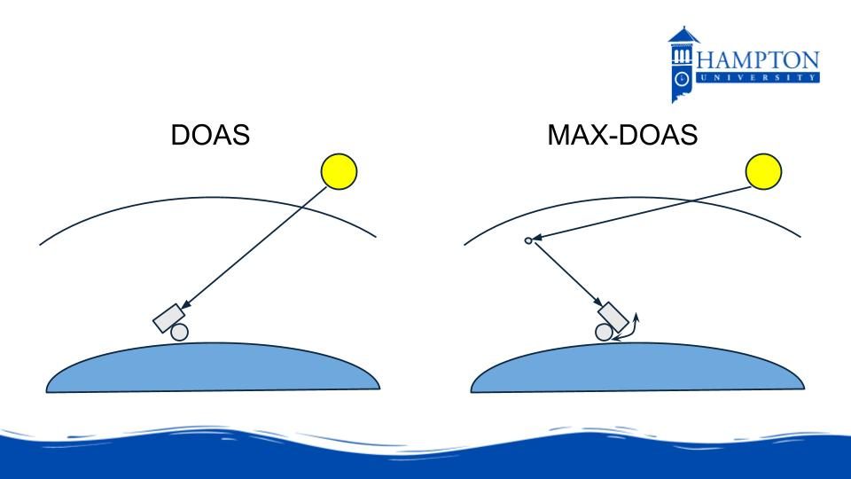

**The information that will eventually be here is summarized from: https://pandora.gsfc.nasa.gov

Pandora Instruments are a part of the Pandonia Global Network. They utilize UV and visible spectroscopy methods to determine the composition of the atmosphere. Pandora was designed to specifically look at levels of ozone, nitrogen dioxide and formaldehyde, but has expanded to observe both water vapor and sulfur dioxide in the atmosphere.  
Pandora currently operates two different retrieval methods - either direct sun or sky scan, with the Beer-Lambert-Bouguer Law being the basic principle behind each.  
1. For the direct sun retrieval, the following information is requried:  
   -Sunlight intensity at the top of the Earth's atmosphere  
   -Target molecule absorption spectra in the wavelengths Pandora observes  
2. For the sky scan retrieval, the following information is requried:  
   -Sunlight intensity at the top of the Earth's atmosphere  
   -Target molecule absorption spectra in the wavelengths Pandora observes  
   -Model forecasts/analysis of the expected meteorological variables (Pressure, Temperature, Relative Humidity)  
   -Radiative Transfer Model for the amount of sunlight being scattered off the target molecule in comparison to the background atmosphere  

  

The instrument package is as follows:  
Spectrometer: AvaSpec-ULS 2048x64, on-cooled back-thinned CCD with 2048 x 64 effective pixels and a total size of 29 mm wide and 1 mm high  
Tracker: SciGlob/NASA tracker with 0.01° Step, mechanical encoder and improved Communication SW - tracker to PC.  
Fiber: 400 m core and 440 m clad diameter single strand fused silica fiber with a silicone jacket. Numerical aperture of 0.22, fiber lengths can vary from 3 m to 20 m, typically 10 m.  
Computer: Cincoze DC-1100-R10  
